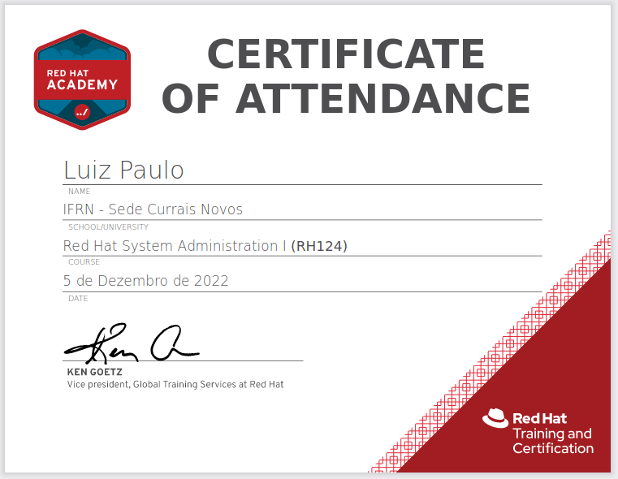

# EM DESTAQUE: certificação RED HAT RH124

    Desde 2020 como usuário linux. Sempre descobrido
    mais sobre o poder de ter o hardware em minhas mãos.

## Referências a manuais utilizadas pelo curso RH124 da RED HAT©

### Capítulo 2 - Acesso à linha de comando

	intro(1) bash(1) console(4) pts(4) ssh(1) ssh-keygen(1)
	init(8) inittab(5)
	 
	bash(1) date(1) file(1) cat(1) more(1)
	less(1) head(1) passwd(1) tail(1) wc(1)
	 

### Capítulo 3 - Gerenciamento de arquivos na linha de comando

	hler(7)
	 
	info libc 'file name resolution'  
	bash(7) cd(1) ls(1) pwd(1) unicode(1) utf-8(7)
	 
	cp(1) mkdir(1) mv(1) rm(1) rmdir(1)
	 
	ln(1) inode(1) 
	info ln 
	 
	glob(7) isalpha(3) path_resolution(7)
	 

### Capítulo 4 - Ajuda no Red Hat Enterprise Linux®

	man(1) mandb(8) man-pages(7) less(1) intro(2) intro(5) 
	intro(7) intro(8)
	 
	pinfo info
	 pinfo pinfo 
	pinfo(1) info(1)
	 

### Capítulo 5 - Criação, visualização e edição de arquivos de texto

	info bash (seções 3.2.2 e 3.6) 
	info coreutils 'tee invocation' (seção 17.1) 
	mail(1) tee(1) tty(1) 
	vim(1) vimtutor(1) 
	env(1) builtins(1) 

### Capítulo 6 - Gerenciamento de usuários e grupos locais

	id(1) passwd(5) group(5) 
	info libc (seção 30) 
	su(1) sudo(8) visudo(8) sudoers(5) 
	info libc persona (seção 30.2) 
	useradd(8) usermod(8) userdel(8) 
	groupadd(8) groupdel(8) groupmod(8) 
	chage(1) shadow(5) crypt(8) 

### Capítulo 7 - Controle de acesso a arquivos

	info coreutils (seção 13) 
	ls(1) chmod(1) chown(1) chgrp(1) 
	umask(1)

### Capítulo 8 - Monitoramento e gerenciamento de processos no linux

	info libc signal (seção 24) 
	info libc processes (seção 26) 
	ps(1) signal(7) 
    bash(1) builtins(1) ps(1) sleep(1) 
    kill(1) killall(1) pgrep(1) pkill(1) pstree(1) w(1) 
    top(1) uptime(1)

### Capítulo 9 - Controle de Serviços e Daemons

    systemd(1) systemd.unit(5) systemd.service(5) systemd.socket(5) systemctl(1)

### Capítulo 10 - Configuração e proteção do SSH

    ssh(1) hostname(1)  
    ssh-keygen(1) ssh-copy-id(1) ssh-agent(1) ssh-add(1)  
    sshd_config(5)

### Capítulo 11 - Análise e armazenamento de logs

    systemd-journald.service(8) rsyslogd(8) rsyslog.conf(5)  
    logger(1) logrotate(8)  
    journalctl(1) systemd.journal-fields(7) systemd.time(7)  
    systemd-journald.conf(5) systemd-journald(8)  
    timedatectl(1) tzselect(8) chronyd(8) chrony.conf(5) chronyc(1)

### Capítulo 12 - Gerenciamento de redes

    services(5) ping(8) biosdevname(1) udev(7) 
    ip-link(8) ip-address(8) ip-route(8) ip(8) pint(8) tracepath(8)
    traceroute(8) ss(8) netstat(8) 
    NetworkManager(8) nmcli(1) nmcli-examples(5) nm-settings(5) hostnamectl(1)
    resolv.conf(5) hostname(5) 
    hosts(5) getent(1) host(1)

### Capítulo 13 - Gerenciamento e transferência de arquivos

    tar(1) gzip(1) gunzip(1) bzip(1) bunzip2(1) xz(1) unxz(1) 
    scp(1) sftp(1) 
    rsync(1)

### Capítulo 14 - Instalação e atualização de pacotes de software

    subscription-manager(8) rct(8) 
    rpm(8) rpm2cpio(8) cpio(1) rmpkeys(8) 
    yum(1) yum.conf(5) yum-config-manager(1)

### Capítulo 15 - Acesso a sistemas de arquivos Linux

    df(1) du(1) 
    lslbk(8) mount(8) umount(8) lsof(8) 
    locate(1) updatedb(8) find(1)

### Capítulo 16 - Análise e obteção de suporte (específico do RHEL)

    cockpit(1) cockpit-ws(8) cockpit.conf(5) 
    sosreport(1) 
    insights-client(8) insights-client.conf(5)

##### RH124 Red Hat System Administration | 8.0

#### ------------------------------------------
